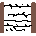

# Kursk
<h2><i>Dự án LTNC của Nguyễn Việt Hoàng-21020323</i><h2>
<h2> 1.Cách sử dụng chương trình</h2>
  
  Bước 1: Fork toàn bộ repository này về máy/ Download folder về máy.
  
  Bước 2: Giải nén file zip.
  
  Bước 3: Nhấp vào file short cut có tên Kursk  ở bên ngoài folder Data.(Nếu không được có thể vào file HoangGame.exe trong folder Data)
  
  Bước 4: Bỏ qua các cảnh báo của Microsoft Defender để khởi chạy chương trình từ bên ngoài và chơi (Yên tâm folder không có virus)
  
 <h2> 2. Mô tả chung về trò chơi</h2>
 
  - Kursk là một game 2D 2 người chơi. Mỗi người chơi sẽ sử dụng các loại đạn của mình cố gắng bắn và tiêu diệt xe đối phương. Ai bị phá hủy xe tăng   3 lần trước là người thua cuộc. Tùy loại đạn mà sát thương nhận được là khác nhau
 
  - Game chỉ sử dụng đầu vào là bàn phím.
  
  - Có 4 bản đồ với địa hình, tính chất khác nhau để lựa chọn khi bắt đầu vào game.
  
  - Sử dụng phím P để dừng game và đọc hướng dẫn, phím O để tiếp tục game.
  
  
  - Nếu chưa có ai chiến thắng, trò chơi sẽ tiếp diễn.
  
  <h2> 3.Các chức năng đã cài đặt</h2>
  
  - Thay đổi 3 loại đạn khác nhau, với tốc độ, hình ảnh, sức mạnh , âm thanh khác nhau.
    
  
  - Có âm thanh và âm nhạc đầy đủ trong game
  
  - Có các chướng ngại vật khác nhau trong bản đồ, có thể dễ dàng thay đổi bản đồ để có 1 trải nghiệm mới.
  
  
  
  
   
   
  - Có các bonus trong round để tăng tốc độ, tăng sức mạnh cho tăng.
  
  
  
  - Có thể dừng trò chơi, xem hướng dẫn.
  
  - Có thể chọn bản đồ.
  
   <h2> 4.Các kỹ thuật sử dụng</h2>
  
  <h3>SDL</h3>
  
  - Render hình ảnh, âm thanh
  
  - Load hình ảnh, âm thanh đơn giản (100% hình ảnh là tự vẽ)
  
  - Sử dụng các hàm xoay, lật ảnh để giảm số lượng file đầu vào
  
  - Xử lý input từ bàn phím
  
  <h3>C++</h3>
  
  - Sử dụng các kiến thức về Vector, Array, Class, Thread, con trỏ, nhập xuất file ....
  
  - Sử dụng Project để chia nhỏ các file cpp và các file h.
  
  - Giảm bớt sự phức tạp của hàm main và sử dụng nhiều hằng số để dễ sửa đổi các thông số của trò chơi. 
  
  <h3> Nguồn tham khảo </h3>
  
  - Các slide , file giáo trình trong chương trình học.
  
  - Xem thêm về logic game loop tại Youtube: Let's Make Games : https://www.youtube.com/c/CarlBirch
  
  - Toàn bộ là tự code.
  
  - Nguồn âm thanh tại Pixabay.com
  
  <h3> Video Demo</h3>
  https://youtu.be/Mw11sto39Bo
  
  <h2> 5.Kết luận</h2>
  
  - Qua thời gian làm chương trình em đã có thêm nhiều bài học, nhiều kinh nghiệm về lập trình, về clean code, về xử lí project để sản phẩm ngày càng hoàn thiện hơn, kỹ năng được cải thiện so với đầu khóa học
  
  - Tuy vậy, code game vẫn có nhiều phần bị lặp/dài, cần được refactor trau chuốt hơn nữa. Kiến thức vẫn còn hổng, hạn chế dẫn đến 1 số bug rất mất thời gian sửa. Và 1 điều em vẫn khá tiếc là hitbox của game đôi lúc vẫn bị thất thường (em sẽ cố gắng sao cho viên đạn đi càng chính xác vào chiếc xe tăng càng tốt)
  
  - Em khá tâm đắc việc thay đổi các loại đạn sẽ giúp trò chơi có thêm chiều sâu, cũng như việc thay đổi map tăng thêm tính đa dạng.
  
  - Tuy vậy em vẫn chưa thể triển khai hoàn chỉnh hệ thống Menu cũng như chưa thể Replay do một số lỗi phát sinh chưa tìm được nguyên nhân. Để phát triển chương trình em sẽ hoàn thành thật tốt vấn đề Menu và Replay, cũng như là refactor code cho sạch đẹp hơn, và phát triển thêm về các map, các loại đối tượng khác trong bản đồ, ví dụ như là ụ súng tự động bắn, vật phẩm làm thôi miên xe đối phương.
  
 <b> Em xin cảm ơn mọi người vì đã đọc và đánh giá project đầu tiên của em. Tự nhận thấy vẫn còn rất nhiều điều cần phải tiến bộ, tuy nhiên em cũng tự nhận bản thân đã khá cố gắng và tâm huyết cho game. Vì vậy em mong mọi người có thể nhẹ tay 1 chút với dự án của mình.
   
   Em xin chân thành cảm ơn
  
 Mức điểm tự đánh giá: 8.5-9 </b>
  
  
  
